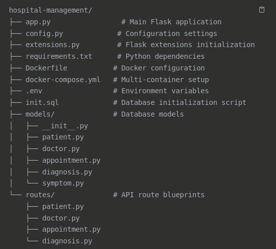

# Hospital Management System with AI Disease Prediction

A comprehensive hospital management system built with Flask, PostgreSQL, and machine learning capabilities for disease prediction based on patient symptoms.


## Features

- Patient Management: Complete CRUD operations for patient records
- Doctor Management: Manage doctor profiles, specializations, and availability
- Appointment Scheduling: Book, update, and track patient appointments
- AI-Powered Diagnosis: Machine learning model to predict diseases based on symptoms
- Disease Prediction API: Standalone endpoint for symptom-based disease prediction
- RESTful API: Clean and well-documented API endpoints
- Containerized Deployment: Docker and Docker Compose support
- Database Migrations: Flask-Migrate for database schema management


## Technology Stack

- Backend: Flask (Python)
- Database: PostgreSQL
- ORM: SQLAlchemy
- Machine Learning: Scikit-learn, NumPy
- Containerization: Docker & Docker Compose
- Database Migrations: Flask-Migrate


## Project Structure




## Quickstart

Clone the project

```bash
  git clone git@github.com:melvis8/TPINF22-FLASK.git hospital-management
cd hospital-management
```

Start the application

```bash
  docker-compose up --build
```

## Access the application
- API Base URL: 
```http 
  http://localhost:5000
```
- Health Check: 
```http 
  http://localhost:5000/health
```
- API Documentation: 
```http 
  http://localhost:5000/
```

## Manual Set-up

- creating a virtual environment for flask
```bash
    python3 -m venv .venv
    source .venv/bin/activate 
```

- run project locally with this command

```bash
    PYTHONPATH=. python3 app/run.py
```
- create Database

```bash
  sudo -u postgres psql
CREATE DATABASE hospital_db;
CREATE USER hospital_user WITH PASSWORD 'hospital_pass';
GRANT ALL PRIVILEGES ON DATABASE hospital_db TO hospital_user;
\q
```
- Access database
```bash
    psql -U admin -d hospital
```
Then you enter the admin password : 
##### melvis123

- Install Python Dependencies

```bash
 pip install -r requirements.txt
```
## Set Environment Variables

```bash
export FLASK_APP=app.py
export FLASK_ENV=development
export POSTGRES_HOST=localhost
export POSTGRES_PORT=5432
export POSTGRES_DB=hospital_db
export POSTGRES_USER=hospital_user
export POSTGRES_PASSWORD=hospital_pass
```

## Initialize Database

```bash
flask db init
flask db migrate -m "Initial migration"
flask db upgrade
```

## Run Application

```bash
 python app.py
```

## API Endpoints

### Health Check

- Application health status
 ```http 
  GET /health
```  

### Patients

- List all patients
 ```http 
  GET http://localhost:5000/patients
```  
- Create new patient
 ```http 
 POST http://localhost:5000/patients
```  
- Get patient by ID
 ```http 
  GET http://localhost:5000/patients{id}
```  
- Update patient
 ```http 
 PUT http://localhost:5000/patients/{id} 
```  

### Doctors

- List all doctors
 ```http 
  GET http://localhost:5000/doctors
```  
- Create new doctor
 ```http 
 POST http://localhost:5000/doctors
```  
- Get doctor by ID
 ```http 
  GET http://localhost:5000/doctors/{id}
```  
- Update doctor
 ```http 
 PUT http://localhost:5000/doctors/{id} 
```  

### Diagnosis

-  List all diagnoses
 ```http 
  GET http://localhost:5000/diagnosis
```  
- Create diagnosis with AI prediction
 ```http 
 POST http://localhost:5000/diagnosis
```  
- Get specific diagnosis
 ```http 
  GET http://localhost:5000/diagnosis/{id}
```  
- Update diagnosis
 ```http 
 PUT http://localhost:5000/diagnosis/{id}
```
-  Delete diagnosis
 ```http 
 DELETE http://localhost:5000/diagnosis/{id}
```
- Prescription
 ```http 
 POST http://localhost:5000/prescription
```
- Get prescription
 ```http 
 GET http://localhost:5000/prescription/
```
- Change prescription
 ```http 
 PUT http://localhost:5000/prescription
```

 ### Appointments

- List all appointments
 ```http 
  GET http://localhost:5000/appointments
```  
- Create new appointment
 ```http 
 POST /http://localhost:5000/appointments
```  
- Get appointment by ID
 ```http 
  GET http://localhost:5000/appointments/{id}
```  
- Update appointment
 ```http 
 PUT http://localhost:5000/appointments/{id} 
```
 ## AI Disease Prediction
 The system includes a machine learning model that predicts diseases based on patient symptoms.

 - Discuss with Gemini AI
 
 ```http 
 POST http://localhost:5000/ai/gemini
```  

 ### How it works:
-  Symptom Input: Doctors input patient symptoms
- ML Processing: Random Forest classifier processes symptom patterns
- Probability Output: Returns disease predictions with confidence scores
- Integration: Automatically integrates predictions into diagnosis records

### Supported Predictions:
- Flu (fever, cough, fatigue, headache, nausea)
- Pneumonia (chest pain, shortness of breath, cough, fever)
- Migraine (headache, nausea, vomiting, light sensitivity)
- Gastroenteritis (abdominal pain, nausea, fever, diarrhea, vomiting)
- Arthritis (joint pain, swelling, stiffness, muscle pain)
- Hypertension (high blood pressure, chest pain, dizziness, blurred vision)

## Example Usage:

### Predict Disease from Symptoms:
```bash
    curl -X POST http://localhost:5000/api/predict-disease \
  -H "Content-Type: application/json" \
  -d '{
    "symptoms": ["fever", "cough", "fatigue"]
  }'
```

### Response
```json
 {
  "symptoms": ["fever", "cough", "fatigue"],
  "predictions": {
    "flu": 0.85,
    "pneumonia": 0.12,
    "gastroenteritis": 0.03
  },
  "most_likely_disease": "flu",
  "probability": 0.85,
  "timestamp": "2025-06-05T10:30:00"
}
```

### Create Diagnosis with AI Prediction:

```bash
  curl -X POST http://localhost:5000/api/diagnosis \
  -H "Content-Type: application/json" \
  -d '{
    "patient_id": 1,
    "doctor_id": 1,
    "symptoms": ["fever", "cough", "chest pain"],
    "treatment": "Rest, fluids, monitor symptoms"
  }'
```

## Sample Data
The system comes with pre-populated sample data:

### Sample Doctors:

- Dr. Sarah Johnson (Cardiology)
- Dr. Michael Chen (Neurology)
- Dr. Emily Rodriguez (Pediatrics)
- Dr. David Wilson (Orthopedics)
- Dr. Lisa Anderson (Internal Medicine)

### Sample Patients:

- John Smith, Mary Johnson, Robert Brown, Jennifer Davis, William Wilson

## API Request Examples

### Create Patient
```bash
  curl -X POST http://localhost:5000/api/patients \
  -H "Content-Type: application/json" \
  -d '{
    "name": "Alice Cooper",
    "email": "alice.cooper@email.com",
    "phone": "+1234567905",
    "date_of_birth": "1988-12-25",
    "gender": "Female",
    "address": "123 Health St, Medical City",
    "medical_history": "No known allergies",
    "emergency_contact": "Bob Cooper - +1234567906"
  }'
```

### Create Appointment

```bash
    curl -X POST http://localhost:5000/api/appointments \
  -H "Content-Type: application/json" \
  -d '{
    "patient_id": 1,
    "doctor_id": 1,
    "appointment_date": "2025-06-10T14:30:00",
    "duration_minutes": 45,
    "reason": "Regular checkup",
    "notes": "Patient reports feeling well"
  }'
```

## API Reference

#### Get all items

```http
  GET /api/items
```

| Variable | Description    | Default               |
| :-------- | :------- | :------------------------- |
| FLASK_ENV | Flask environment |  development
| SECRET_KEY | `Flask secret key | dev-secret-key |
| POSTGRES_HOST| PostgreSQL host |localhost |
| POSTGRES_PORT | PostgreSQL port |5432 |
| POSTGRES_DB | Database name | hospital_db |
| POSTGRES_USER | Database user | hospital_user |
| POSTGRES_PASSWORD | Database password | hospital_pass|


## Database Schema

### Patients Table

- ID, Name, Email, Phone, Date of Birth
- Gender, Address, Medical History
- Emergency Contact, Timestamps

### Doctors Table

- ID, Name, Email, Phone, Specialization
- License Number, Department, Experience
- Qualification, Consultation Fee, Availability

### Appointments Table

- ID, Patient ID, Doctor ID, Appointment Date
- Duration, Status, Reason, Notes, Timestamps

### Diagnoses Table

- ID, Patient ID, Doctor ID, Symptoms
- Diagnosis, Treatment, Predicted Disease
- Predicted Probability, Follow-up Date

## Development
### Adding New Features

- Create new model in models/ directory
- Add corresponding routes in routes/ directory
- Register blueprint in app.py
- Run database migration

### Database Migration

```bash
  flask db migrate -m "Description of changes"
flask db upgrade
```
### Running Test 
```bash
  python -m pytest tests/
```

## Production Deployment
### Docker Production Setup
- Update environment variables in production
- Use production-grade WSGI server:

```dockerfile
CMD ["gunicorn", "--bind", "0.0.0.0:5000", "--workers", "4", "app:app"]
```
## Security Considerations

- Change default passwords and secret keys
- Use environment variables for sensitive data
- Enable HTTPS in production
- Implement proper authentication and authorization
- Regular security audits and updates

### Contributing

- Fork the repository
- Create feature branch 
```bash 
git checkout -b feature/new-feature
```
- Commit changes 
```bash
git commit -am 'Add new feature'
```
- Push to branch 
```bash
git push origin feature/new-feature
```
Create Pull Request

## License
This project is licensed under the MIT License - see the LICENSE file for details.

## Support
For support and questions:

- Create an issue in the repository
- Check the API documentation at 
```http
http://localhost:5000/
```
- Review the sample requests in this README

## Medical Disclaimer
This system is for educational and demonstration purposes only. The AI disease prediction feature should not be used for actual medical diagnosis. Always consult qualified healthcare professionals for medical advice and treatment.